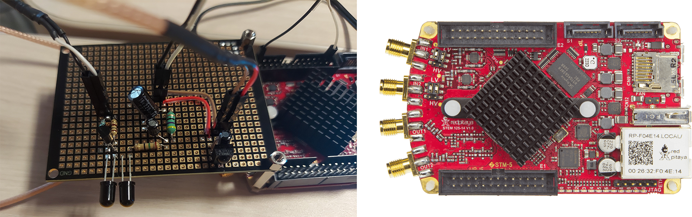

# Stranded in Space with Red Pitaya

A 24-hour hackathon centered around the Red Pitaya STEMlab 125-14,
a multifunction measurement tool based on the Xilinx Zynq SoC.
Our team assembled and soldered two hat boards,
integrating IR LEDs and IR receivers to enable signal transmission and reception.
We leveraged Red Pitaya's Python API
to access the signal acquisition and generation functions of the FPGA,
enabling full-duplex Morse code communication.
A web server was developed in Python using FastAPI
to create a styled frontend for sending and receiving messages.
This repository contains our code for the hackathon and its preliminary workshops,
as well as the relevant informational resources which were made available to us.

### Resources

[Hackathon instructions on Notion](https://clean-moose-dbb.notion.site/Hackathon-Stranded-in-Space-with-Red-Pitaya-d8953433090949369d376d8645da7aef)

[Hackathon hat board schematics PDF](resources/hackathon-schematic.pdf)

[IR receiver datasheet](resources/datasheets/ir-receiver.pdf)

[NPN transistor datasheet](resources/datasheets/npn-transistor.pdf)

[Workshop files on Notion](https://clean-moose-dbb.notion.site/Stranded-in-Space-with-Red-Pitaya-3ad972255fe94cdcac00e23f79404835)
